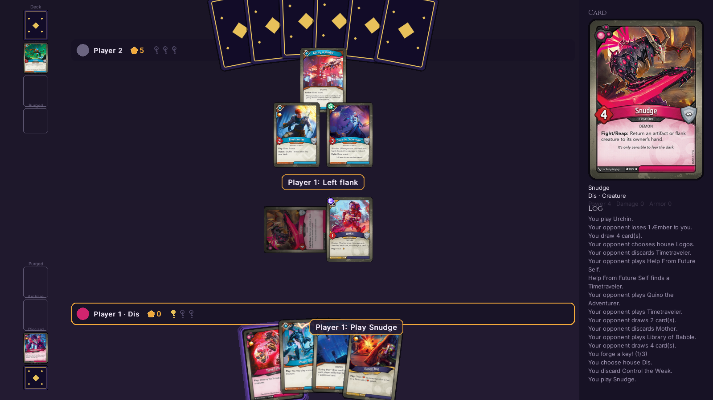

# KeyForge Phase 1.1 (Archon) — GUI

A graphical, animated, fully playable client for Phase 1.1 of the project
(Archon format, Fignor vs. Igor), built on top of the engine in
[`Code/Non-GUI`](../Non-GUI). See
[`PHASE_1_1_GUI_PLAN.md`](PHASE_1_1_GUI_PLAN.md) for the design.



The GUI never reimplements a rule: it renders `Game` state and submits
choices for `game.pending_decision`, exactly like the engine's own text UI.

## Running it

```bash
pip install -r requirements.txt
python main.py
```

That opens the menu: pick each seat's deck (Fignor/Igor) and type
(Human/Bot), who goes first, and Start. Or skip the menu and jump straight
into a match:

```bash
python main.py --p1 human --p2 bot --p1-deck fignor --p2-deck igor --seed 1
```

`--p1`/`--p2` accept `human` or `bot`; the other flags mirror the text UI's
(`--p1-deck`, `--p2-deck`, `--first p1|p2`, `--seed`, `--max-turns`).

## Playing

- **Click a glowing card** to play/discard/reap/fight/use it. A card with
  several legal options opens a small chooser beside it ("Play" /
  "Discard" / ...). Discarding, and ending your turn while other actions
  are still legal, need a second click on the same button; any other click
  cancels that.
- **Dimmed cards** can't be used right now — hover one to see why (wrong
  house, first-turn limit, Ember Imp's play limit, Lifeward, Scrambler
  Storm, already exhausted, ...).
- **Right-click** any card — board, hand, pile browser, decklist, a
  decision screen — to read it full size. Clicking the zoom panel on the
  right does the same, and middle-click still works. Hovering any card
  (or any line in the log) shows it in the zoom panel.
- **All options (O)** lists every legal choice as rows or a readable card
  grid. It can answer *any* decision.
- **Decision screens**: the mulligan and "take your archive?" decisions
  lay the cards out large; choosing a flank shows clickable slots at each
  end of your creature row; choosing a house shows what each house would
  let you do; effect ordering numbers your picks and has Undo.
- **Board**: creatures (left) and artifacts (right) share one row per
  player; every card shows its remaining power, damage, armor, captured
  Æmber, Elusive/Skirmish and "Exhausted". Your hand is sorted with your
  active house first. Hover a key icon to see the turn it was forged, or a
  status chip to see which card caused it.
- **Piles** (left column) are clickable at any time, including during the
  opponent's turn (archive: owner only; decks: never).
- **The first player** is announced after mulligans and tagged in the HUD;
  the prompt bar tracks their one-card first-turn limit.
- **D** decklists · **H** or **/** help · **M** mute · **Space** skip
  animation · **1/2/3** animation speed · **F11** fullscreen · **F3** FPS ·
  **Esc** close a popup or leave the game.
- **Hot-seat** (human vs. human): a "Pass to Player N" screen hides the
  board whenever the pending decision belongs to the other player.
- **Spectating** (bot vs. bot): players are addressed as "Player 1/2", and
  **R** reveals both hands.
- **Bots** use a simple rules-aware strategy (`bots/heuristic_bot.py`):
  they pick the house that lets them do the most, play what they can,
  fight only favorable fights, and end the turn when nothing useful is
  left.

## Game history and replays

Every game is recorded automatically in a local SQLite database,
`Code/GUI/data/history.sqlite3` (git-ignored; override with the
`KEYFORGE_HISTORY_DB` environment variable). A game is stored as its
settings, its seed and the index of every choice made, zlib-compressed —
typically a couple of KB — which is enough to reproduce it exactly.
Unfinished games (quit, crash) are kept as "abandoned".

- **Main menu → Past Games** lists them newest first, with result, turns
  and keys, plus Replay and Delete.
- **Game over → Watch Replay** opens the game you just finished.
- **In a replay**: Play/Pause (Space), step one decision (← →), jump a turn
  (↑ ↓ / PgUp PgDn), start/end (Home/End), click the timeline to scrub,
  **V** to view from the other player's side, and show/hide both hands.

The game-over screen draws over the final board and lists each player's
keys, Æmber and the turn every key was forged; **View Board** hides the
panel so you can inspect the final position.

See [`../PLAYTEST_FIX_PLAN.md`](../PLAYTEST_FIX_PLAN.md) and
[`UX_FIX_PLAN.md`](UX_FIX_PLAN.md) for what was wrong, why, and how it was
fixed.

## Layout

```
gui/
  settings.py        theme colors, sizes, board layout bands, animation timings
  app.py              window, scene stack, logical-canvas scaling, hotkeys
  assets.py           card art (rounded, cached, scaled), procedural card back
                       and icons, fonts, optional sound
  engine_bridge.py     owns the Game + bot seats; before/events/after per submit();
                       ReplayBridge steps a recorded game
  history.py           the SQLite game history (compressed move records)
  snapshot.py          BoardSnapshot: every card's zone/position/face_up, per viewer
  layout.py            board bands -> concrete rects and card-fan/row slots
  board.py             the CardSprite pool + HUD/particle/overlay state, and
                       card_at(): the one "which card is under the mouse" answer
  option_labels.py     turns any Decision option or log event into a sentence
  anim/
    tween.py, easing.py, animator.py   a small Tween/Sequence/Parallel/Delay/Call
                                         tree, played one queued "beat" at a time
    particles.py, director.py          particle effects; log event -> beat catalogue
  sprites/
    card_sprite.py, hud.py, piles.py, widgets.py, log_panel.py, overlays.py
  decision/
    panel.py            answers every DecisionKind: board clicks, dedicated screens
                        (mulligan, archive, flank), and the All-options modal
  scenes/
    menu_scene.py, game_scene.py, curtain_scene.py, game_over_scene.py,
    history_scene.py, replay_scene.py
main.py                 entry point
tests/                  see below
```

### How a move gets animated

`EngineBridge.submit()` snapshots the board before and after the call and
returns the new slice of `game.log.events`. `Director.build()` walks those
events in order and turns each into a short animation ("beat"): a card
flies from hand to its flank, æmber gems spark off to the HUD, a fight
lunge-and-shake, a destroyed card crumbles to embers, and so on — then
always finishes with a catch-all "settle" pass that tweens *every* card to
its true position and every HUD counter to its true value. That settle
pass is what guarantees the board can never end up visually out of sync
with the engine, even for a rules interaction this module doesn't
specifically animate.

## Tests

```bash
python -m unittest discover -s tests
```

- `test_assets.py` — every one of the 49 Phase 1 cards resolves to real
  art at every size the app uses.
- `test_option_labels.py` — every option type and log-event kind produces
  a readable sentence.
- `test_snapshot_layout.py` — no two board bands overlap, and every card
  (rotated, 1-12 per zone) stays inside its own band; hidden zones never
  carry a face-up card for the wrong viewer; upgrades are always public.
- `test_headless_autoplay.py` — runs full bot-vs-bot games through
  Board + Director + Animator and checks the board never drifts out of
  sync with the engine.
- `test_ui_playthrough.py` — plays whole games through **real pygame click
  events** (not direct engine calls) for human-vs-bot, bot-vs-human, and
  human-vs-human hot-seat, plus menu → game and game-over → rematch/menu
  navigation.
- `test_game_scene_features.py` — the decklist viewer, the help overlay,
  spectate's "reveal hands" toggle, and the you/opponent vs. "Player N"
  phrasing switch.
- `test_input_coords.py` — hover and click resolve to the right card at
  window sizes other than the canvas's own 1600x900 (the bug behind most
  of `UX_FIX_PLAN.md`'s findings).
- `test_decision_ui.py` — the action chooser and Options grid never show
  the same card's art twice; MULLIGAN always opens the dedicated review
  screen; Discard and a premature End Turn always require a second click.
- `test_click_accuracy.py` — renders every card into an ID map and checks
  that hover/click pick the card actually drawn on top (≥99% of pixels),
  plus chooser click-through and upgrade-to-host click routing.
- `test_playtest_fixes.py` — first-player messaging, "why can't I use
  this" dimming, the archive/flank/ordering/house screens, confirm
  disarming, pile browsing on the opponent's turn, hand sorting, HUD chip
  overflow, the 12px font minimum, log hover, right-click inspect, queued
  clicks, and a real-speed game checking the HUD always matches the engine
  and is never covered by a card.
- `test_history_replay.py` — record → compress → store → load → replay
  reproduces the game exactly; abandoned games; the Past Games list and
  the replay scene end to end.
- `test_app_window.py` — letterbox math and window-resize survival.
- `test_performance.py` — a populated board stays comfortably under the
  frame budget.

All run headless (`SDL_VIDEODRIVER=dummy`, set automatically by
`tests/helpers.py`) so they need no display.

## Notable simplifications vs. the design doc

- The opening deal (before the first Decision, i.e. before any mulligan)
  isn't animated — `Game.__init__` deals hands internally before the GUI
  ever sees the game, so there's no "before" state to animate from. Every
  draw after that animates normally.
- A card's face flips to its final, correct state (per the current
  viewer's visibility rules) at the start of each move's animation rather
  than mid-flight; only its *position* is what's actually tweened. Reads
  cleanly in practice and was far simpler to get right.
- The hot-seat viewer switch is instant (no cross-fade) once the "I'm
  Ready" curtain is dismissed.
